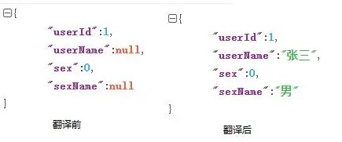

# easy_trans

# 介绍

在项目开发中，借助JPA和Mybatis Plus我们已经可以做到单表查询不写SQL，但是很多时候我们需要关联字典表，关联其他表来实现字典码和外键的翻译，又要去写sql，使用 EasyTrans 你只需要在被翻译的pojo属性上加一个注解即可完成字典码/外键 翻译,查询其他表翻译的工作组件会自动完成。

先看效果：    



easy trans适用于四种场景   

1   我有一个id，但是我需要给客户展示他的title/name  但是我又不想自己手动做表关联查询   
2   我有一个字典码 sex  和 一个字典值0  我希望能翻译成   男  给客户展示。   
3   我有一组user id 比如 1，2,3  我希望能展示成 张三,李四,王五 给客户   
4   我有一个枚举，枚举里有一个title字段，我想给前端展示title的值 给客户

easy trans原理    
  
当需要翻译的vo实现了TransPojo 接口后，组件自带一个getTransMap 方法可以获取到一个map，组件根据id/字典码/枚举 找到翻译数据源后进行翻译，把结果放到这个map中，在给前端json序列化前，把map的内容和vo的其他的字段平铺到一起，实现我只有userid没有userName这个字段，但是json中会自动包含userName这个字段的效果。    

easy trans 支持的五种类型    

1   字典翻译(TransType.DICTIONARY)，需要使用者把字典信息刷新到DictionaryTransService 中进行缓存，使用字典翻译的时候取缓存数据源    
2   简单翻译(TransType.SIMPLE)，比如有userId需要userName或者userPo给前端，原理是组件使用MybatisPlus/JPA的API自动进行查询，把结果放到TransMap中。    
3   跨微服务翻译(TransType.RPC)，比如订单和用户是2个微服务，但是我要在订单详情里展示订单的创建人的用户名，需要用到RPC翻译，原理是订单微服务使用restTemplate调用用户服务的一个统一的接口，把需要翻译的id传过去，然后用户微服务使用MybatisPlus/JPA的API自动进行查询把结果给订单微服务，然后订单微服务拿到数据后进行翻译，当然使用者只是需要一个注解，这些事情都是由组件自动完成的。    
4   AutoTrans(TransType.AUTO)，还是id翻译name场景，但是使用者如果想组件调用自己写的方法而不通过Mybatis Plus/JPA 的API进行数据查询，就可以使用AutoTrans    
5   枚举翻译(TransType.ENUM) 比如我要把SEX.BOY 翻译为男，可以用枚举翻译。     


# 食用步骤
## 技术经理/架构 需要做的事情
1 、先把maven 引用加上（如果1.2.0版本无法引用请使用1.1.9版本，中央仓库更新有延迟）
``` xml
       <dependency>
            <groupId>com.fhs-opensource</groupId>
            <artifactId>easy-trans-spring-boot-starter</artifactId>
            <version>1.2.2</version>
        </dependency>
```
   Mybatis plus用户另外还需要加以下扩展：
``` xml
        <dependency>
            <groupId>com.fhs-opensource</groupId>
            <artifactId>easy_trans_mybatis_plus_extend</artifactId>
            <version>1.2.2</version>
        </dependency>
```
  JPA 用户另外还需要加以下扩展：
``` xml
        <dependency>
            <groupId>com.fhs-opensource</groupId>
            <artifactId>easy_trans_jpa_extend</artifactId>
            <version>1.2.2</version>
        </dependency>
```
 如果使用Redis请添加redis的引用(如果之前加过了请不要重复添加)
``` xml
        <dependency>
            <groupId>org.springframework.boot</groupId>
            <artifactId>spring-boot-starter-data-redis</artifactId>
        </dependency>
```
注意：非maven中央仓库更新可能延迟，如果高版本无法引入请尝试切到低一个版本过一天后在切回来。   
2、在yaml中添加如下配置
``` YAML
easy-trans:
   autotrans: # 如果没使用到autotrans可以不配置
       #您的service/dao所在的包 支持通配符比如com.*.**.service.**，他的默认值是com.*.*.service.impl
       package: com.fhs.test.service.**;com.fhs.test.dao.** 
   #启用redis缓存 如果不用redis请设置为false
   is-enable-redis: true 
   #启用全局翻译(拦截所有responseBody进行自动翻译)，如果对于性能要求很高可关闭此配置
   is-enable-global: true 
   #启用平铺模式
   is-enable-tile: true
spring:#如果用到redis配置redis连接
  redis:
    host: 192.168.0.213
    port: 6379
    password: 123456
    database: 0
    timeout: 6000
```
3、如果不使用redis，请在启动类加禁用掉redis的自动配置类
``` java
@SpringBootApplication(exclude = { RedisAutoConfiguration.class })
```
4、初始化字典数据(如果你们项目没字典表请忽略)
 ``` java
        @Autowired  //注入字典翻译服务
        private  DictionaryTransService dictionaryTransService;
	    //在某处将字典缓存刷新到翻译服务中，以下是demo
	    Map<String,String> transMap = new HashMap<>();
        transMap.put("0","男");
        transMap.put("1","女");
        dictionaryTransService.refreshCache("sex",transMap);
```  
5、微服务配置(比如订单服务用到了用户服务的user数据来进行翻译，不牵扯微服务的可以不管)   
 A、白名单添加  /easyTrans/proxy/**   保证其不被拦截，RPC trans的时候easytrans会自动调用目标微服务的接口来获取数据。   
 B、应用之间的认证可以通过filter/interceptor实现，然后自定义RestTemplate 保证easytrans在请求用户服务的时候带上需要认证的参数


## 普通程序员需要做的事情
pojo 中添加
``` java   
@Data
@Builder
@AllArgsConstructor
@NoArgsConstructor
//实现TransPojo  接口，代表这个类需要被翻译或者被当作翻译的数据源
public class Student implements TransPojo {
     // 字典翻译 ref为非必填
    @Trans(type = TransType.DICTIONARY,key = "sex",ref = "sexName")
    private Integer sex;

    //这个字段可以不写，实现了TransPojo接口后有一个getTransMap方法，sexName可以让前端去transMap取
    private String sexName;
    
    //SIMPLE 翻译，用于关联其他的表进行翻译    schoolName 为 School 的一个字段
    @Trans(type = TransType.SIMPLE,target = School.class,fields = "schoolName")
    private String schoolId;
	
	//远程翻译，调用其他微服务的数据源进行翻译
	@Trans(type = TransType.RPC,targetClassName = "com.fhs.test.pojo.School",fields = "schoolName",serviceName = "easyTrans",alias = "middle")
    private String middleSchoolId;
	
	// 枚举翻译，返回文科还是理科给前端
	@Trans(type=TransType.ENUM,key = "desc")
    private StudentType studentType = StudentType.ARTS;

    public static enum StudentType{

        ARTS("文科"),
        SCIENCES("理科");

        private String desc;
        StudentType(String desc){
            this.desc = desc;
        }
    }
}
```
然后访问你的controller，看返回结果。


# 参与贡献和技术支持

 如果遇到使用问题可以加QQ群:976278956   
 如果你们使用了此插件，请留下单位名称。
# 示例项目

https://gitee.com/fhs-opensource/easy_trans_springboot_demo

# 插件文档

https://gitee.com/fhs-opensource/easy_trans/wikis/%E5%BF%AB%E9%80%9F%E5%BC%80%E5%A7%8B

# 已经使用此插件的企业
1、陕西小伙伴网络科技有限公司   
2、中软国际云智能业务集团   
3、深圳市易流科技股份有限公司   
4、陕西逐道科技有限公司   
5、深圳市易联联盟科技有限公司

# 求star
如果您觉得本软件好用，请帮忙给个star吧，如果您能发动身边的同项目组同事一起给个star那就太感谢您了
